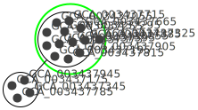

============
m2m_analysis
============
m2m_analysis is a supplementary command installed by metage2metabo. It is separated from m2m because it has heavy dependencies. Also, m2m_analysis steps can be time consuming.

Requirements
------------

m2m_analysis needs:

* `Oog Power Graph Command line tool <http://www.biotec.tu-dresden.de/research/schroeder/powergraphs/download-command-line-tool.html>`__: used to create a svg file of the power graph. It is a jar file (compiled for Java 6), so you need at least Java 6.

* These python packages:

    * `networkx <https://github.com/networkx/networkx>`__: to create graph from miscoto results
    * `ete3 <https://github.com/etetoolkit/ete>`__: to add taxonomy information on the graph if you used mpwt taxon file
    * `powergrasp <https://github.com/Aluriak/PowerGrASP>`__: to compress networkx graph (which required `graphviz <https://github.com/graphp/graphviz>`__)

Presentation
------------

m2m_analysis goes deeper in the analysis compare to m2m. In m2m_analysis, the enumeration of all solution is computed, this step is far more time consuming than the others (union or intersection).

This first step is done by ``m2m_analysis enum``. It will enumerate all the possible solutions (minimal communities), select the optimal ones and then create the json file containing all the optimal solutions.

In a second step (``m2m_analysis graph``), the optimal solutions from the enumeration are stored in a graph. The nodes of this graph are each organism present in at least one solution. An edge connects two nodes, only if the two organisms (represented by the node) co-occur in at least one of the enumerated communities.

The last step (``m2m_analysis powergraph``) compresses the graph into a power graph (in bbl format). Then it creates a svg picture of this power graph.

m2m Tutorial
------------

Test data is avaible in the `Github repository <https://github.com/AuReMe/metage2metabo/tree/master/test>`__.
It contains enough data to run the different subcommands.

m2m_analysis enum
+++++++++++++++++
``m2m_analysis enum`` runs miscoto with enumeration on a set of target.

It uses the following mandatory inputs (run ``m2m_analysis enum --help`` for optional arguments):

-n directory           directory of metabolic networks, 
                        in SBML format
-s file                seeds SBML file
-t directory           targets SBML file or folder containing multiple targets SBML files
-o directory           output directory for results

Optional arguments:

-q               quiet mode
-m file                host metabolic network in SBML

.. code:: sh

    m2m_analysis enum -n toy_bact -s metabolic_data/seeds_toy.sbml -t metabolic_data/targets_toy.sbml -o output_directory

* standard output
    .. code::

        ######### Enumeration of solution for: targets_toy #########
        ######### Enumeration of minimal communities #########
        5 minimal communities to produce the target metabolites
        ######### Key species: Union of minimal communities #########
        # Bacteria occurring in at least one minimal community enabling the producibility of the target metabolites given as inputs
        Key species = 17
        GCA_003437885
        GCA_003437665
        GCA_003437945
        GCA_003437595
        GCA_003437195
        GCA_003437345
        GCA_003437815
        GCA_003438055
        GCA_003437715
        GCA_003437325
        GCA_003437905
        GCA_003437375
        GCA_003437175
        GCA_003437785
        GCA_003437055
        GCA_003437255
        GCA_003437295
        ######### Essential symbionts: Intersection of minimal communities #########
        # Bacteria occurring in ALL minimal community enabling the producibility of the target metabolites given as inputs
        Essential symbionts = 12
        GCA_003437885
        GCA_003437665
        GCA_003437595
        GCA_003437905
        GCA_003437195
        GCA_003437375
        GCA_003437055
        GCA_003437815
        GCA_003438055
        GCA_003437715
        GCA_003437255
        GCA_003437295
        ######### Alternative symbionts: Difference between Union and Intersection #########
        # Bacteria occurring in at least one minimal community but not all minimal community enabling the producibility of the target metabolites given as inputs
        Alternative symbionts = 5
        GCA_003437945
        GCA_003437325
        GCA_003437175
        GCA_003437785
        GCA_003437345

* files output
    ::

        output_directory
        ├── json
        │   ├── targets_toy.json

m2m_analysis stats
++++++++++++++++++
``m2m_analysis stats`` computes statistics on key species.

It uses the following mandatory inputs (run ``m2m_analysis stats --help`` for optional arguments):

-j directory           directory of miscoto output JSONs or single JSON
-o directory           output directory for results

Optional arguments:

-q               quiet mode
--taxon file           mpwt taxon file

.. code:: sh

    m2m_analysis stats -j output_directory/json -o output_directory --taxon taxon_id.tsv

* standard output
    .. code::

        --- Stats runtime 0.00 seconds ---

        --- Total runtime 0.01 seconds ---

* files output
    ::

        output_directory
        ├── key_species_stats.tsv
        ├── key_species_supdata.tsv
        ├── miscoto_stats.txt

m2m_analysis graph
++++++++++++++++++
``m2m_analysis graph`` creates the graph containing the solutions.

It uses the following mandatory inputs (run ``m2m_analysis graph --help`` for optional arguments):

-j directory           directory of miscoto output JSONs or single JSON
-t directory           targets SBML file or folder containing multiple targets SBML files
-o directory           output directory for results

Optional arguments:

-q               quiet mode
--taxon file           mpwt taxon file

You can use the `taxon file from gut experience <https://github.com/AuReMe/metage2metabo/blob/master/article_data/gut_microbiota/taxon_id.tsv>`__.

.. code:: sh

    m2m_analysis graph -j output_directory/json -t metabolic_data/targets_toy.sbml -o output_directory --taxon taxon_id.tsv

* standard output
    .. code::

        ######### Graph of targets_toy #########
        Number of nodes: 17
        Number of edges: 126

* files output
    ::

        output_directory
        ├── gml
        │   ├── targets_toy.gml
        ├── key_species_stats.tsv
        ├── key_species_supdata.tsv
        ├── miscoto_stats.txt

m2m_analysis powergraph
+++++++++++++++++++++++
``m2m_analysis powergraph`` compresses the graph and create a svg picture.

It uses the following mandatory inputs (run ``m2m_analysis powergraph --help`` for optional arguments):

--oog file             Oog jar file
-g file                directory of GML files or a GML file
-o directory           output directory for results

Optional arguments:

-q               quiet mode

.. code:: sh

    m2m_analysis powergraph --oog Oog.jar -g output_directory/gml -o output_directory

* standard output
    .. code::

        ######### Graph compression: targets_toy #########
        Number of powernodes: 3
        Number of poweredges: 2
        ********************************************************************************
        *  Oog - PowerGraph Library (Matthias Reimann, c 2006-2012)                    *
        *  PowerGraph Analysis through the command line interface of Oog               *
        *                                                                              *
        *  Please cite us: Royer L, Reimann M, Andreopoulos B, Schroeder M             *
        *  (2008) Unraveling Protein Networks with Power Graph Analysis.               *
        *  PLoS Comput Biol 4(7): e1000108                                             *
        *                                                                              *
        *  Contact: reimann@biotec.tu-dresden.de                                       *
        ********************************************************************************
        <II> Current time: 2019/10/17 13:09:56
        <II> Oog build: Oog_build_2012.04.17_14.16.48

        <II> Working directory: . (/shared/metage2metabo/test/metabolic_data/)
        <II> Graph file directories: [.]
        <II> Output directory: test_out/svg
        <II> Loading graph (targets_toy.bbl) ... 27ms
        <II> Arrange Graph ... Exception in thread "PowerGraphArranger" java.lang.IndexOutOfBoundsException: Index 20 out of bounds for length 20
            at java.base/jdk.internal.util.Preconditions.outOfBounds(Preconditions.java:64)
            at java.base/jdk.internal.util.Preconditions.outOfBoundsCheckIndex(Preconditions.java:70)
            at java.base/jdk.internal.util.Preconditions.checkIndex(Preconditions.java:248)
            at java.base/java.util.Objects.checkIndex(Objects.java:372)
            at java.base/java.util.ArrayList.get(ArrayList.java:458)
            at org.mattlab.eaglevista.graph.OogGraph.getID_(OogGraph.java:2703)
            at org.mattlab.eaglevista.graph.OogPGArranger.arrangeRec(OogPGArranger.java:361)
            at org.mattlab.eaglevista.graph.OogPGArranger.arrange(OogPGArranger.java:327)
            at org.mattlab.eaglevista.graph.OogPGArranger.run(OogPGArranger.java:271)
            at java.base/java.lang.Thread.run(Thread.java:834)
        4001ms (15ms)
        <II> Create SVG ... 469ms
        <II> Image written (test_out/svg/targets_toy.bbl.svg)

* files output
    ::

        output_directory
        ├── bbl
        │   ├── targets_toy.bbl
        ├── svg
        │   ├── targets_toy.bbl.svg

This command creates the following svg:

m2m_analysis workflow
+++++++++++++++++++++
``m2m_analysis workflow`` runs the all m2m_analysis workflow.

It uses the following mandatory inputs (run ``m2m_analysis workflow --help`` for optional arguments):

-n directory           directory of metabolic networks, 
                        in SBML format
-s file                seeds SBML file
-t directory           targets SBML file or folder containing multiple targets SBML files
-o directory           output directory for results
--oog file             Oog jar file

Optional arguments:

-q               quiet mode
-m file                host metabolic network in SBML
--taxon file           mpwt taxon file

.. code:: sh

    m2m_analysis workflow -n toy_bact -s metabolic_data/seeds_toy.sbml -t metabolic_data/targets_toy.sbml -o output_directory --oog Oog.jar --taxon taxon_id.tsv

* standard output
    .. code::

        ######### Enumeration of solution for: targets_toy #########
        ######### Enumeration of minimal communities #########
        5 minimal communities to produce the target metabolites
        ######### Key species: Union of minimal communities #########
        # Bacteria occurring in at least one minimal community enabling the producibility of the target metabolites given as inputs
        Key species = 17
        GCA_003437885
        GCA_003437665
        GCA_003437945
        GCA_003437595
        GCA_003437195
        GCA_003437345
        GCA_003437815
        GCA_003438055
        GCA_003437715
        GCA_003437325
        GCA_003437905
        GCA_003437375
        GCA_003437175
        GCA_003437785
        GCA_003437055
        GCA_003437255
        GCA_003437295
        ######### Essential symbionts: Intersection of minimal communities #########
        # Bacteria occurring in ALL minimal community enabling the producibility of the target metabolites given as inputs
        Essential symbionts = 12
        GCA_003437885
        GCA_003437665
        GCA_003437595
        GCA_003437905
        GCA_003437195
        GCA_003437375
        GCA_003437055
        GCA_003437815
        GCA_003438055
        GCA_003437715
        GCA_003437255
        GCA_003437295
        ######### Alternative symbionts: Difference between Union and Intersection #########
        # Bacteria occurring in at least one minimal community but not all minimal community enabling the producibility of the target metabolites given as inputs
        Alternative symbionts = 5
        GCA_003437945
        GCA_003437325
        GCA_003437175
        GCA_003437785
        GCA_003437345
        --- Enumeration runtime 6.74 seconds ---

        ######### Graph of targets_toy #########
        Number of nodes: 17
        Number of edges: 126
        --- Graph runtime 0.02 seconds ---

        ######### Graph compression: targets_toy #########
        Number of powernodes: 3
        Number of poweredges: 2
        ********************************************************************************
        *  Oog - PowerGraph Library (Matthias Reimann, c 2006-2012)                    *
        *  PowerGraph Analysis through the command line interface of Oog               *
        *                                                                              *
        *  Please cite us: Royer L, Reimann M, Andreopoulos B, Schroeder M             *
        *  (2008) Unraveling Protein Networks with Power Graph Analysis.               *
        *  PLoS Comput Biol 4(7): e1000108                                             *
        *                                                                              *
        *  Contact: reimann@biotec.tu-dresden.de                                       *
        ********************************************************************************
        <II> Current time: 2019/10/17 13:09:56
        <II> Oog build: Oog_build_2012.04.17_14.16.48

        <II> Working directory: . (/shared/metage2metabo/test/metabolic_data/)
        <II> Graph file directories: [.]
        <II> Output directory: test_out/svg
        <II> Loading graph (targets_toy.bbl) ... 27ms
        <II> Arrange Graph ... Exception in thread "PowerGraphArranger" java.lang.IndexOutOfBoundsException: Index 20 out of bounds for length 20
            at java.base/jdk.internal.util.Preconditions.outOfBounds(Preconditions.java:64)
            at java.base/jdk.internal.util.Preconditions.outOfBoundsCheckIndex(Preconditions.java:70)
            at java.base/jdk.internal.util.Preconditions.checkIndex(Preconditions.java:248)
            at java.base/java.util.Objects.checkIndex(Objects.java:372)
            at java.base/java.util.ArrayList.get(ArrayList.java:458)
            at org.mattlab.eaglevista.graph.OogGraph.getID_(OogGraph.java:2703)
            at org.mattlab.eaglevista.graph.OogPGArranger.arrangeRec(OogPGArranger.java:361)
            at org.mattlab.eaglevista.graph.OogPGArranger.arrange(OogPGArranger.java:327)
            at org.mattlab.eaglevista.graph.OogPGArranger.run(OogPGArranger.java:271)
            at java.base/java.lang.Thread.run(Thread.java:834)
        4001ms (15ms)
        <II> Create SVG ... 469ms
        <II> Image written (test_out/svg/targets_toy.bbl.svg)
        --- Powergraph runtime 7.80 seconds ---

        --- m2m_analysis runtime 14.56 seconds ---

        --- Total runtime 21.06 seconds ---

* files output
    ::

        output_directory
        ├── json
        │   ├── targets_toy.json
        ├── gml
        │   ├── targets_toy.gml
        ├── bbl
        │   ├── targets_toy.bbl
        ├── svg
        │   ├── targets_toy.bbl.svg
        ├── key_species_stats.tsv
        ├── key_species_supdata.tsv
        ├── miscoto_stats.txt

m2m_analysis output files
-------------------------

::

    output_directory
    ├── json
    │   ├── targets_toy.json
    ├── gml
    │   ├── targets_toy.gml
    ├── bbl
    │   ├── targets_toy.bbl
    ├── svg
    │   ├── targets_toy.bbl.svg
    ├── key_species_stats.tsv
    ├── key_species_supdata.tsv
    ├── miscoto_stats.txt
    ├── taxon_phylum.tsv (with the ``--taxon`` option)
    ├── taxon_tree.txt (with the ``--taxon`` option)

Miscoto results
+++++++++++++++

``miscoto_stats.txt``: for each target, this file summarizes the result of miscoto with: the number of targets, the size of the minimal solutions, the size of the union of the minimal solution (the key species), the size of the intersection of the minimal solutions (the essential symbionts)) and the size of the enumeration (the number of minimal solutions).

``json/*.json``: for each target, there will be a miscoto json result file. If you have given one target file, the result file will be named according to the name of the target file.

The json contains 21 keys:

* ``bacteria``: organisms in the optimal solution.

* ``still_unprod``: compounds unproducible by the community.

* ``newly_prod``: compounds newly producible by the community.

* ``producible``: compounds producible by the community.

* ``union_bacteria``: organisms from all the minimal communities.

* ``inter_bacteria``: organisms from the intersection of all the minimal communities.

* ``one_model``: results of the optimal solution.

* ``exchanged``, ``union_exchanged``, ``inter_exchanged`` and ``enum_exchanged``: the exchanged compounds by the community, this step needs a lot of resources so it is not used in m2m. If you want to use it, use miscoto with the ``minexch`` option.

* ``key_species``: organisms from all the minimal communities.

* ``essential_symbionts``: organisms in the intersection of all the minimal communities. They are occuring in all minimal solution.

* ``alternative_symbionts``: organisms appearing in at least one minimal community but not in all.

* ``score_optimum_inter``: the optimum score found for the intersection, it corresponds to the number of organism in the minimal community.

* ``score_optimum_union``: the optimum score found for the union, it corresponds to the number of organism in the minimal community.

* ``inter_targetsproducers``: the organism that have the final reaction to produce the target in the intersection. It is a dictionary, with each target as key and the organism producing these targets as value.

* ``union_targetsproducers``: the organism that have the final reaction to produce the target in the union. It is a dictionary, with each target as key and the organism producing these targets as value.

* ``one_model_targetsproducers``: the organism that have the final reaction to produce the target in the optimal solution. It is a dictionary, with each target as key and the organism producing these targets as value.

* ``enum_bacteria``: all the minimal solutions. It is a dictionary, with a number (linked to a minimal solution) as key and the organisms in the corresponding minimal solution as value.

* ``enum_targetsproducers``: the organism that have the final reaction to produce the target in the union. It is a dictionary, with a number (corresponding to a minimal solution) as key and a dictionary as value This sub-dictionary contains each target as key and the organism producing these targets as value.

Key species files
+++++++++++++++++

``key_species_stats.tsv``: for each target, this file contains the number of key species, essential and alternative symbionts. If you have used the "--taxon" option, the column corresponds to each taxonomic groups.

``key_species_supdata.tsv``: for each target, this file contains the name of species in the key species, essential or alternative symbionts groups. If you have used the "--taxon" option, there will be new rows linked to each taxonomic groups.

Solution graph
++++++++++++++

The solution graph is stored in a gml file (``gml/*.gml``). The nodes of the graph are species occuring in minimal solutions. An edge is created between two nodes when the two nodes are in the same minimal solutions.

Compressed solution graph (power graph)
++++++++++++++++++++++++++++++++++++++

The previous solution graph is then compressed into a power graph using PowerGrASP. The result file is bbl file (``bbl/*.bbl``).

You can use this file to visualize the power graph with Cytoscape. To do this you need the `version 2.8.2 of Cytoscape <http://chianti.ucsd.edu/Cyto-2%5F8%5F2/>`__ and the `CyOog plugin <http://www.biotec.tu-dresden.de/research/schroeder/powergraphs/download-cytoscape-plugin.html>`__.
When you have installed Cytoscape, put the file ``CyOog.jar`` in ``path/to/cytoscape/install/dir/plugins/``.

m2m_analysis can also create visualization of the power graph.

Picture of the power graph
++++++++++++++++++++++++++

The compresed graph is then drawn using the Oog Power Graph Command line tool. A svg file is then created (``svg/*.svg``).

Taxonomy linked files
+++++++++++++++++++++

If you have used the ``--taxon``, two new files have been created:

``taxon_phylum.tsv``: it is a tsv file with 9 columns. The row corresponds to the species in your community. For each species, you will have its name in your dataset, its taxID (from taxon_id.tsv), an attributed taxonomic name (used in the power graph), then the taxonomic classification: phylum, class, order, family, genus and species.

``taxon_tree.txt``: the topology of the taxonomic classification of your species according to the NCBI taxonomy.
