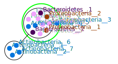

============
m2m_analysis
============
m2m_analysis is a supplementary command installed by metage2metabo. It is separated from m2m because it has heavy dependencies. Also, m2m_analysis steps can be time consuming.

Requirements
------------

m2m_analysis needs:

* `Oog Power Graph Command line tool <https://github.com/AuReMe/metage2metabo/tree/main/external_dependencies/Oog_CommandLineTool2012>`__: used to create a svg file of the power graph. It is a jar file (``Oog.jar`` compiled for Java 6), so you need at least Java 6.

* These python packages:

    * `networkx <https://github.com/networkx/networkx>`__: to create graph from miscoto results
    * `ete3 <https://github.com/etetoolkit/ete>`__: to add taxonomy information on the graph if you used mpwt taxon file
    * `powergrasp <https://github.com/Aluriak/PowerGrASP>`__: to compress networkx graph (which required `graphviz <https://github.com/graphp/graphviz>`__)

Presentation
------------

m2m_analysis goes deeper in the analysis compare to m2m. In m2m_analysis, the enumeration of all solution is computed, this step is far more time consuming than the others (union or intersection).

This first step is done by ``m2m_analysis enum``. It will enumerate all the possible solutions (minimal communities), select the optimal ones and then create the json file containing all the optimal solutions.

In a second step (``m2m_analysis graph``), the optimal solutions from the enumeration are stored in a graph. The nodes of this graph are each organism present in at least one solution. An edge connects two nodes, only if the two organisms (represented by the node) co-occur in at least one of the enumerated communities.

The last step (``m2m_analysis powergraph``) compresses the graph into a power graph (in bbl format). Then it creates a svg picture of this power graph.

m2m Tutorial
------------

Test data is avaible in the `Github repository <https://github.com/AuReMe/metage2metabo/tree/main/test>`__.
It contains enough data to run the different subcommands.

m2m_analysis enum
+++++++++++++++++
``m2m_analysis enum`` runs miscoto with enumeration on a set of target.

It uses the following mandatory inputs (run ``m2m_analysis enum --help`` for optional arguments):

-n directory           directory of metabolic networks, 
                        in SBML format
-s file                seeds SBML file
-t directory           targets SBML file or folder containing multiple targets SBML files
-o directory           output directory for results

Optional arguments:

-q               quiet mode
-m file                host metabolic network in SBML

.. code:: sh

    m2m_analysis enum -n toy_bact -s metabolic_data/seeds_toy.sbml -t metabolic_data/targets_toy.sbml -o output_directory

* standard output
    .. code::

        ###############################################
        #                                             #
        #      Enumeration of minimal communities     #
        #                                             #
        ###############################################

        ######### Enumeration of solution for: targets_toy #########
        /shared/Softwares/git/miscoto/miscoto/encodings/community_soup.lp
        ######### Enumeration of minimal communities #########
        5 minimal communities (each containing 13 species) producing the target metabolites
        ######### Key species: Union of minimal communities #########
        # Bacteria occurring in at least one minimal community enabling the producibility of the target metabolites given as inputs
        Key species = 17
        GCA_003437905
        GCA_003437255
        GCA_003437345
        GCA_003437785
        GCA_003437595
        GCA_003437715
        GCA_003437375
        GCA_003437325
        GCA_003437815
        GCA_003437295
        GCA_003437175
        GCA_003437885
        GCA_003437945
        GCA_003437665
        GCA_003437195
        GCA_003437055
        GCA_003438055
        ######### Essential symbionts: Intersection of minimal communities #########
        # Bacteria occurring in ALL minimal community enabling the producibility of the target metabolites given as inputs
        Essential symbionts = 12
        GCA_003437815
        GCA_003437295
        GCA_003437905
        GCA_003437255
        GCA_003437885
        GCA_003437665
        GCA_003437195
        GCA_003437595
        GCA_003437055
        GCA_003438055
        GCA_003437715
        GCA_003437375
        ######### Alternative symbionts: Difference between Union and Intersection #########
        # Bacteria occurring in at least one minimal community but not all minimal community enabling the producibility of the target metabolites given as inputs
        Alternative symbionts = 5
        GCA_003437325
        GCA_003437945
        GCA_003437175
        GCA_003437785
        GCA_003437345
        --- Enumeration runtime 4.64 seconds ---

        --- Total runtime 4.65 seconds ---

* files output
    ::

        output_directory
        ├── json
        │   ├── targets_toy.json
        ├── m2m_analysis_enum.log
        ├── m2m_analysis_metadata.json

m2m_analysis graph
++++++++++++++++++
``m2m_analysis graph`` creates the graph containing the solutions.

It uses the following mandatory inputs (run ``m2m_analysis graph --help`` for optional arguments):

-j directory           directory of miscoto output JSONs or single JSON
-t directory           targets SBML file or folder containing multiple targets SBML files
-o directory           output directory for results

Optional arguments:

-q               quiet mode
--taxon file           mpwt taxon file
--level LEVEL         Taxonomy level, must be: phylum, class, order, family, genus or species. By default, it is phylum.

You can use the `taxon file from gut experience <https://github.com/AuReMe/metage2metabo/blob/main/article_data/gut_microbiota/taxon_id.tsv>`__.

.. code:: sh

    m2m_analysis graph -j output_directory/json -t metabolic_data/targets_toy.sbml -o output_directory

* standard output
    .. code::

        ###############################################
        #                                             #
        #         Solution graph creation             #
        #                                             #
        ###############################################

        ######### Graph of targets_toy #########
        Number of nodes: 17
        Number of edges: 126
        --- Graph runtime 0.01 seconds ---

        --- Total runtime 0.01 seconds ---

* files output
    ::

        output_directory
        ├── gml
        │   ├── targets_toy.gml
        ├── key_species.json
        ├── key_species_stats.tsv
        ├── m2m_analysis_graph.log
        ├── miscoto_stats.txt
        ├── m2m_analysis_metadata.json

m2m_analysis powergraph
+++++++++++++++++++++++
``m2m_analysis powergraph`` compresses the graph and create a svg picture.

It uses the following mandatory inputs (run ``m2m_analysis powergraph --help`` for optional arguments):

-j JSON_DIR_OR_FILE                Folder containing JSON files of single JSON file containing miscoto enumeration results
-g file                directory of GML files or a GML file
-o directory           output directory for results

Optional arguments:

-q               quiet mode
--oog file             Oog jar file (present in external_dependencies folder of the github repository)
--taxon TAXON         Mpwt taxon file
--level LEVEL         Taxonomy level, must be: phylum, class, order, family, genus or species. By default, it is phylum.

.. code:: sh

    m2m_analysis powergraph --oog Oog.jar -g output_directory/gml -j output_directory/json -o output_directory

* standard output
    .. code::

        ###############################################
        #                                             #
        #  Compression and visualisation of graph     #
        #                                             #
        ###############################################

        ######### Graph compression: targets_toy #########
        Number of powernodes: 3
        Number of poweredges: 2
        Compression runtime 1.52 seconds ---

        ######### Test powergraph heuristics: targets_toy #########
        Same combinations between theorical (5) and solution (5)
        The powergraph seems to be an optimal representation of the solutions.

        Same combinations between theorical (5) and the enumeration of solutions by m2m_analysis  (5)
        The powergraph seems to be an optimal representation of the solutions.

        Same number of solution between the computed combinations from powernodes (5) and the enumeration of solutions by m2m_analysis (5)
        But this does not indicate that the powernodes are an optimal representation but that they contain the solution.

        It seems that there are no heuristics in powergraph so it could be possible to create a boolean equation.
        ######### Boolean equation of minimal communities #########
        The boolean equation can only be created for simple case (without too many combinations).
        Boolean equation seems good, as it has the same combinations (5) than the one from enumeration (5).
        Boolean equation: 
        (( GCA_003437905 ) & 
        ( GCA_003437255 ) & 
        ( GCA_003437785 | GCA_003437345 | GCA_003437175 | GCA_003437325 | GCA_003437945 ) & 
        ( GCA_003437595 ) & 
        ( GCA_003437715 ) & 
        ( GCA_003437375 ) & 
        ( GCA_003437815 ) & 
        ( GCA_003437295 ) & 
        ( GCA_003437885 ) & 
        ( GCA_003437665 ) & 
        ( GCA_003437195 ) & 
        ( GCA_003437055 ) & 
        ( GCA_003438055 ) )
        ######### PowerGraph visualization: targets_toy #########
        Creation of the powergraph website accessible at output_directory/html/targets_toy
        Creation of the powergraph svg accessible at output_directory/svg
        ********************************************************************************
        *  Oog - PowerGraph Library (Matthias Reimann, c 2006-2012)                    *
        *  PowerGraph Analysis through the command line interface of Oog               *
        *                                                                              *
        *  Please cite us: Royer L, Reimann M, Andreopoulos B, Schroeder M             *
        *  (2008) Unraveling Protein Networks with Power Graph Analysis.               *
        *  PLoS Comput Biol 4(7): e1000108                                             *
        *                                                                              *
        *  Contact: reimann@biotec.tu-dresden.de                                       *
        ********************************************************************************
        <II> Current time: 2024/03/01 11:56:46
        <II> Oog build: Oog_build_2012.04.17_14.16.48
            
        <II> Working directory: . (/shared/Softwares/git/metage2metabo/test/metabolic_data/)
        <II> Graph file directories: [.]
        <II> Output directory: output_directory/svg
        <II> Loading graph (targets_toy.bbl) ... 21ms
        <II> Arrange Graph ... Exception in thread "PowerGraphArranger" java.lang.IndexOutOfBoundsException: Index 20 out of bounds for length 20
            at java.base/jdk.internal.util.Preconditions.outOfBounds(Preconditions.java:64)
            at java.base/jdk.internal.util.Preconditions.outOfBoundsCheckIndex(Preconditions.java:70)
            at java.base/jdk.internal.util.Preconditions.checkIndex(Preconditions.java:248)
            at java.base/java.util.Objects.checkIndex(Objects.java:374)
            at java.base/java.util.ArrayList.get(ArrayList.java:459)
            at org.mattlab.eaglevista.graph.OogGraph.getID_(OogGraph.java:2703)
            at org.mattlab.eaglevista.graph.OogPGArranger.arrangeRec(OogPGArranger.java:361)
            at org.mattlab.eaglevista.graph.OogPGArranger.arrange(OogPGArranger.java:327)
            at org.mattlab.eaglevista.graph.OogPGArranger.run(OogPGArranger.java:271)
            at java.base/java.lang.Thread.run(Thread.java:829)
        4001ms (14ms)
        <II> Create SVG ... 275ms
        <II> Image written (output_directory/svg/targets_toy.bbl.svg)
        --- Powergraph runtime 6.06 seconds ---

        --- Total runtime 6.08 seconds ---

* files output
    ::

        output_directory
        ├── bbl
        │   ├── targets_toy.bbl
        ├── html
        │   ├── targets_toy
        │   |   ├── js
        │   |   |   ├── cytoscape.min.js
        │   |   |   ├── cytoscape-cose-bilkent.js
        │   |   |   ├── graph.js
        │   |   ├── index.html
        │   |   ├── style.css
        │   ├── targets_toy_powergraph.html
        ├── svg
        │   ├── targets_toy.bbl.svg
        ├── m2m_analysis_powergraph.log
        ├── m2m_analysis_metadata.json

This command creates the following svg (node colords: dark pink for essential symbionts and blue for alternative symbionts):

m2m_analysis workflow
+++++++++++++++++++++
``m2m_analysis workflow`` runs the all m2m_analysis workflow.

It uses the following mandatory inputs (run ``m2m_analysis workflow --help`` for optional arguments):

-n directory           directory of metabolic networks, 
                        in SBML format
-s file                seeds SBML file
-t directory           targets SBML file or folder containing multiple targets SBML files
-o directory           output directory for results

Optional arguments:

-q               quiet mode
-m file                host metabolic network in SBML
--taxon file           mpwt taxon file
--oog file             Oog jar file
--level LEVEL         Taxonomy level, must be: phylum, class, order, family, genus or species. By default, it is phylum.

.. code:: sh

    m2m_analysis workflow -n toy_bact -s metabolic_data/seeds_toy.sbml -t metabolic_data/targets_toy.sbml -o output_directory --oog Oog.jar --taxon taxon_id.tsv

* standard output
    .. code::

        ###############################################
        #                                             #
        #      Enumeration of minimal communities     #
        #                                             #
        ###############################################

        ######### Enumeration of solution for: targets_toy #########
        /shared/Softwares/git/miscoto/miscoto/encodings/community_soup.lp
        ######### Enumeration of minimal communities #########
        5 minimal communities (each containing 13 species) producing the target metabolites
        ######### Key species: Union of minimal communities #########
        # Bacteria occurring in at least one minimal community enabling the producibility of the target metabolites given as inputs
        Key species = 17
        GCA_003437195
        GCA_003437885
        GCA_003437055
        GCA_003437815
        GCA_003437375
        GCA_003437665
        GCA_003437175
        GCA_003437945
        GCA_003437715
        GCA_003438055
        GCA_003437345
        GCA_003437905
        GCA_003437325
        GCA_003437255
        GCA_003437595
        GCA_003437785
        GCA_003437295
        ######### Essential symbionts: Intersection of minimal communities #########
        # Bacteria occurring in ALL minimal community enabling the producibility of the target metabolites given as inputs
        Essential symbionts = 12
        GCA_003437195
        GCA_003437885
        GCA_003437055
        GCA_003437815
        GCA_003437375
        GCA_003437905
        GCA_003437665
        GCA_003437255
        GCA_003437595
        GCA_003437715
        GCA_003437295
        GCA_003438055
        ######### Alternative symbionts: Difference between Union and Intersection #########
        # Bacteria occurring in at least one minimal community but not all minimal community enabling the producibility of the target metabolites given as inputs
        Alternative symbionts = 5
        GCA_003437175
        GCA_003437785
        GCA_003437345
        GCA_003437325
        GCA_003437945
        --- Enumeration runtime 4.73 seconds ---

        ###############################################
        #                                             #
        #         Solution graph creation             #
        #                                             #
        ###############################################

        ######### Extract taxon information from taxon_id.tsv. #########
        No taxon_id for GCA_003437378 in file taxon_id.tsv.
        --- Taxonomy runtime 0.02 seconds ---

        ######### Graph of targets_toy #########
        Number of nodes: 17
        Number of edges: 126
        --- Graph runtime 0.03 seconds ---

        ###############################################
        #                                             #
        #  Compression and visualisation of graph     #
        #                                             #
        ###############################################

        ######### Graph compression: targets_toy #########
        Number of powernodes: 3
        Number of poweredges: 2
        Compression runtime 1.55 seconds ---

        ######### Test powergraph heuristics: targets_toy #########
        Same combinations between theorical (5) and solution (5)
        The powergraph seems to be an optimal representation of the solutions.

        Same combinations between theorical (5) and the enumeration of solutions by m2m_analysis  (5)
        The powergraph seems to be an optimal representation of the solutions.

        Same number of solution between the computed combinations from powernodes (5) and the enumeration of solutions by m2m_analysis (5)
        But this does not indicate that the powernodes are an optimal representation but that they contain the solution.

        It seems that there are no heuristics in powergraph so it could be possible to create a boolean equation.
        ######### Boolean equation of minimal communities #########
        The boolean equation can only be created for simple case (without too many combinations).
        Boolean equation seems good, as it has the same combinations (5) than the one from enumeration (5).
        Boolean equation: 
        (( GCA_003437195 ) & 
        ( GCA_003437885 ) & 
        ( GCA_003437055 ) & 
        ( GCA_003437815 ) & 
        ( GCA_003437375 ) & 
        ( GCA_003437665 ) & 
        ( GCA_003437175 | GCA_003437785 | GCA_003437345 | GCA_003437325 | GCA_003437945 ) & 
        ( GCA_003437715 ) & 
        ( GCA_003438055 ) & 
        ( GCA_003437905 ) & 
        ( GCA_003437255 ) & 
        ( GCA_003437595 ) & 
        ( GCA_003437295 ) )

        Boolean equation with taxonomic name: 
        (( Bacillota__2 ) & 
        ( Bacteroidota__2 ) & 
        ( Bacillota__1 ) & 
        ( Bacteroidota__1 ) & 
        ( Actinomycetota__4 ) & 
        ( Bacillota__4 ) & 
        ( Actinomycetota__1 | Actinomycetota__6 | Actinomycetota__3 | Actinomycetota__2 | Actinomycetota__7 ) & 
        ( Actinomycetota__5 ) & 
        ( Bacillota__6 ) & 
        ( Bacillota__5 ) & 
        ( Pseudomonadota__1 ) & 
        ( Bacillota__3 ) & 
        ( Pseudomonadota__2 ) )
        ######### PowerGraph visualization: targets_toy #########
        Creation of the powergraph website accessible at output_directory/html/targets_toy
        Creation of the powergraph svg accessible at output_directory/svg
        ********************************************************************************
        *  Oog - PowerGraph Library (Matthias Reimann, c 2006-2012)                    *
        *  PowerGraph Analysis through the command line interface of Oog               *
        *                                                                              *
        *  Please cite us: Royer L, Reimann M, Andreopoulos B, Schroeder M             *
        *  (2008) Unraveling Protein Networks with Power Graph Analysis.               *
        *  PLoS Comput Biol 4(7): e1000108                                             *
        *                                                                              *
        *  Contact: reimann@biotec.tu-dresden.de                                       *
        ********************************************************************************
        <II> Current time: 2024/03/01 11:58:24
        <II> Oog build: Oog_build_2012.04.17_14.16.48
            
        <II> Working directory: . (/shared/Softwares/git/metage2metabo/test/metabolic_data/)
        <II> Graph file directories: [.]
        <II> Output directory: output_directory/svg
        <II> Loading graph (targets_toy.bbl) ... 18ms
        <II> Arrange Graph ... Exception in thread "PowerGraphArranger" java.lang.IndexOutOfBoundsException: Index 20 out of bounds for length 20
            at java.base/jdk.internal.util.Preconditions.outOfBounds(Preconditions.java:64)
            at java.base/jdk.internal.util.Preconditions.outOfBoundsCheckIndex(Preconditions.java:70)
            at java.base/jdk.internal.util.Preconditions.checkIndex(Preconditions.java:248)
            at java.base/java.util.Objects.checkIndex(Objects.java:374)
            at java.base/java.util.ArrayList.get(ArrayList.java:459)
            at org.mattlab.eaglevista.graph.OogGraph.getID_(OogGraph.java:2703)
            at org.mattlab.eaglevista.graph.OogPGArranger.arrangeRec(OogPGArranger.java:361)
            at org.mattlab.eaglevista.graph.OogPGArranger.arrange(OogPGArranger.java:327)
            at org.mattlab.eaglevista.graph.OogPGArranger.run(OogPGArranger.java:271)
            at java.base/java.lang.Thread.run(Thread.java:829)
        4000ms (13ms)
        <II> Create SVG ... 222ms
        <II> Image written (output_directory/svg/targets_toy.bbl.svg)
        --- Powergraph runtime 6.01 seconds ---

        --- m2m_analysis runtime 10.77 seconds ---

        --- Total runtime 10.79 seconds ---

* files output
    ::

        output_directory
        ├── bbl
        │   ├── targets_toy.bbl
        ├── json
        │   ├── targets_toy.json
        ├── gml
        │   ├── targets_toy.gml
        ├── html
        │   ├── targets_toy
        │   |   ├── js
        │   |   |   ├── cytoscape.min.js
        │   |   |   ├── cytoscape-cose-bilkent.js
        │   |   |   ├── graph.js
        │   |   ├── index.html
        │   |   ├── style.css
        │   ├── targets_toy_taxon
        │   |   ├── js
        │   |   |   ├── cytoscape.min.js
        │   |   |   ├── cytoscape-cose-bilkent.js
        │   |   |   ├── graph.js
        │   |   ├── index.html
        │   |   ├── style.css
        │   ├── targets_toy_powergraph.html
        │   ├── targets_toy_powergraph_taxon.html
        ├── minimal_equation
        │   ├── targets_toy
        │       ├── boolean_equation.json
        │       ├── minimal_equations.tsv
        │       ├── powernodes_composition.json
        ├── svg
        │   ├── targets_toy.bbl.svg
        │   ├── targets_toy_taxon.bbl.svg
        ├── key_species.json
        ├── key_species_stats.tsv
        ├── m2m_analysis_workflow.log
        ├── miscoto_stats.txt
        ├── taxon_tree.txt
        ├── taxonomy_species.tsv
        ├── m2m_analysis_metadata.json

This command creates the previous svg and a new svg with the nodes colored according to their taxons:

m2m_analysis output files
-------------------------

::

    output_directory
    ├── bbl
    │   ├── targets_toy.bbl
    ├── json
    │   ├── targets_toy.json
    ├── gml
    │   ├── targets_toy.gml
    ├── html
    │   ├── targets_toy
    │   |   ├── js
    │   |   |   ├── cytoscape.min.js
    │   |   |   ├── cytoscape-cose-bilkent.js
    │   |   |   ├── graph.js
    │   |   ├── index.html
    │   |   ├── style.css
    │   ├── targets_toy_taxon (with the ``--taxon`` option)
    │   |   ├── js
    │   |   |   ├── cytoscape.min.js
    │   |   |   ├── cytoscape-cose-bilkent.js
    │   |   |   ├── graph.js
    │   |   ├── index.html
    │   |   ├── style.css
    │   ├── targets_toy_powergraph.html
    │   ├── targets_toy_powergraph_taxon.html (with the ``--taxon`` option)
    ├── svg
    │   ├── targets_toy.bbl.svg
    │   ├── targets_toy_taxon.bbl.svg (with the ``--taxon`` option)
    ├── minimal_equation
    │   ├── targets_toy
    │       ├── boolean_equation.json
    │       ├── minimal_equations.tsv
    │       ├── powernodes_composition.json
    ├── key_species.json
    ├── key_species_stats.tsv
    ├── m2m_analysis_*.log
    ├── miscoto_stats.txt
    ├── taxon_tree.txt (with the ``--taxon`` option)
    ├── taxonomy_species.tsv (with the ``--taxon`` option)
    ├── m2m_analysis_metadata.json

Miscoto results
+++++++++++++++

``miscoto_stats.txt``: for each target, this file summarizes the result of miscoto with: the number of targets, the size of the minimal solutions, the size of the union of the minimal solution (the key species), the size of the intersection of the minimal solutions (the essential symbionts)) and the size of the enumeration (the number of minimal solutions).

``json/*.json``: for each target, there will be a miscoto json result file. If you have given one target file, the result file will be named according to the name of the target file.

The json contains 21 keys:

* ``bacteria``: organisms in the optimal solution.

* ``still_unprod``: compounds unproducible by the community.

* ``newly_prod``: compounds newly producible by the community.

* ``producible``: compounds producible by the community.

* ``union_bacteria``: organisms from all the minimal communities.

* ``inter_bacteria``: organisms from the intersection of all the minimal communities.

* ``one_model``: results of the optimal solution.

* ``exchanged``, ``union_exchanged``, ``inter_exchanged`` and ``enum_exchanged``: the exchanged compounds by the community, this step needs a lot of resources so it is not used in m2m. If you want to use it, use miscoto with the ``minexch`` option.

* ``key_species``: organisms from all the minimal communities.

* ``essential_symbionts``: organisms in the intersection of all the minimal communities. They are occuring in all minimal solution.

* ``alternative_symbionts``: organisms appearing in at least one minimal community but not in all.

* ``score_optimum_inter``: the optimum score found for the intersection, it corresponds to the number of organism in the minimal community.

* ``score_optimum_union``: the optimum score found for the union, it corresponds to the number of organism in the minimal community.

* ``inter_targetsproducers``: the organism that have the final reaction to produce the target in the intersection. It is a dictionary, with each target as key and the organism producing these targets as value.

* ``union_targetsproducers``: the organism that have the final reaction to produce the target in the union. It is a dictionary, with each target as key and the organism producing these targets as value.

* ``one_model_targetsproducers``: the organism that have the final reaction to produce the target in the optimal solution. It is a dictionary, with each target as key and the organism producing these targets as value.

* ``enum_bacteria``: all the minimal solutions. It is a dictionary, with a number (linked to a minimal solution) as key and the organisms in the corresponding minimal solution as value.

* ``enum_targetsproducers``: the organism that have the final reaction to produce the target in the union. It is a dictionary, with a number (corresponding to a minimal solution) as key and a dictionary as value This sub-dictionary contains each target as key and the organism producing these targets as value.

Key species files
+++++++++++++++++

``key_species_stats.tsv``: for each target, this file contains the number of key species, essential and alternative symbionts. If you have used the "--taxon" option, the column corresponds to each taxonomic groups.

``key_species.json``: for each target, this json file contains the name of species in the key species, essential or alternative symbionts groups.

For each target, the json contains 2 keys:

* ``essential_symbionts``: a dictionary with a key ``data`` and the name of theorganisms in the essential symbionts. If you use the "--taxon" option, the dictionary keys will be the name of taxon and the values will be the essential symbionts of this taxon.

* ``alternative_symbionts``: a dictionary with a key ``data`` and the name of theorganisms in the alternative symbionts. If you use the "--taxon" option, the dictionary keys will be the name of taxon and the values will be the alternative symbionts of this taxon.

Solution graph
++++++++++++++

The solution graph is stored in a gml file (``gml/*.gml``). The nodes of the graph are species occuring in minimal solutions. An edge is created between two nodes when the two nodes are in the same minimal solutions.

Compressed solution graph (power graph)
+++++++++++++++++++++++++++++++++++++++

The previous solution graph is then compressed into a power graph using PowerGrASP. The result file is bbl file (``bbl/*.bbl``).

You can use this file to visualize the power graph with Cytoscape. To do this you need the `version 2.8.2 of Cytoscape <http://chianti.ucsd.edu/Cyto-2%5F8%5F2/>`__ and the `CyOog plugin <https://github.com/AuReMe/metage2metabo/tree/main/external_dependencies>`__.
When you have installed Cytoscape, put the file ``CyOog.jar`` in ``path/to/cytoscape/install/dir/plugins/``.

m2m_analysis can also create visualization of the power graph.

Boolean equation
++++++++++++++++

If the power graph is simple enough, Metage2Metabo will try to create a boolean equation summarizing the power graph.

Boolean equation is written as follow:

::

    (( GCA_003437195 ) & 
    ( GCA_003437885 ) & 
    ( GCA_003437055 ) & 
    ( GCA_003437815 ) & 
    ( GCA_003437375 ) & 
    ( GCA_003437665 ) & 
    ( GCA_003437175 | GCA_003437785 | GCA_003437345 | GCA_003437325 | GCA_003437945 ) & 
    ( GCA_003437715 ) & 
    ( GCA_003438055 ) & 
    ( GCA_003437905 ) & 
    ( GCA_003437255 ) & 
    ( GCA_003437595 ) & 
    ( GCA_003437295 ) )

``&`` is for the AND operator indicating that the two groups around this operator are needed. ``( GCA_003437195 ) &  ( GCA_003437885 )`` reads as we need both GCA_003437195 AND GCA_003437885.

``|`` is for the OR operator indicating indicating that the the two groups around this operator are redundant. ``( GCA_003437175 | GCA_003437785 | GCA_003437345 | GCA_003437325 | GCA_003437945 )`` reads as we need one organism among GCA_003437175, GCA_003437785, GCA_003437345, GCA_003437325, GCA_003437945.

The results will be stored in three files:

* ``boolean_equation.json``: a json containing several keys: (1) ``boolean_equation`` the boolean equation, (2) ``bacterial_groups`` the identified groups associated with the boolean equation, (3) ``boolean_equation_taxon`` if the "--taxon" option was used the boolean equation with taxon name and (4) if the "--taxon" option was used the identified groups (with taxon name) associated with the boolean equation.

* ``minimal_equations.tsv``: a tsv file containing multiple rows. Each row corresponds to a minimal solution according to the powernodes identified by powergrasp.

* ``powernodes_composition.json``: a json file containing the powernode composition contained in ``minimal_equations.tsv``.

Mini website
++++++++++++

A website like interface is created using the package `bubble-tools <https://github.com/Aluriak/bubble-tools>`__.

For each target, there will a folder in ``html`` folder and a html file (named after the target).
The folder is created by bubble-tools and contains html, css and js files with the information for the visualization.
The html file is a merged of all the files from the folder, to ease the visualization.

To view the html file, open it with a web browser (like ``Firefox``).
There will be nodes in two shapes (circle for essential symbionts and rectangle for alternative symbionts) and colors (dark pink circle for essential symbionts and blue rectangle for alternative symbionts). And powernode will be rectangle.

If you used the "--taxon" option, a new html file is created and labelled as ``*_taxon.html`` (and a corresponding folder is created).
In this html file, the node will be colored according to their taxon and the shape indicated if it is an essential symbiont (circle) or an alternative symbiont (rectangle).

With the html file it is possible to interact and move the node by clicking on them.

Picture of the power graph
++++++++++++++++++++++++++

The compresed graph is then drawn using the Oog Power Graph Command line tool. A svg file is then created (``svg/*.svg``). The nodes will be colored in dark pink for essential symbionts and blue for alternative symbionts.

If you used the "--taxon" option, a new html file is created and labelled as ``svg/*_taxon.svg``. In this file, the node will be colored according to their taxon.

Taxonomy linked files
+++++++++++++++++++++

If you have used the ``--taxon``, two new files have been created:

``taxonomy_species.tsv``: it is a tsv file with 9 columns. The row corresponds to the species in your community. For each species, you will have its name in your dataset, its taxID (from taxon_id.tsv), an attributed taxonomic name (used in the power graph), then the taxonomic classification: phylum, class, order, family, genus and species.

``taxon_tree.txt``: the topology of the taxonomic classification of your species according to the NCBI taxonomy.

More information
-----------------

Take a look at the complete tutorial in the `Github repository <https://github.com/AuReMe/metage2metabo/tree/main/tutorials/method_tutorial>`__
