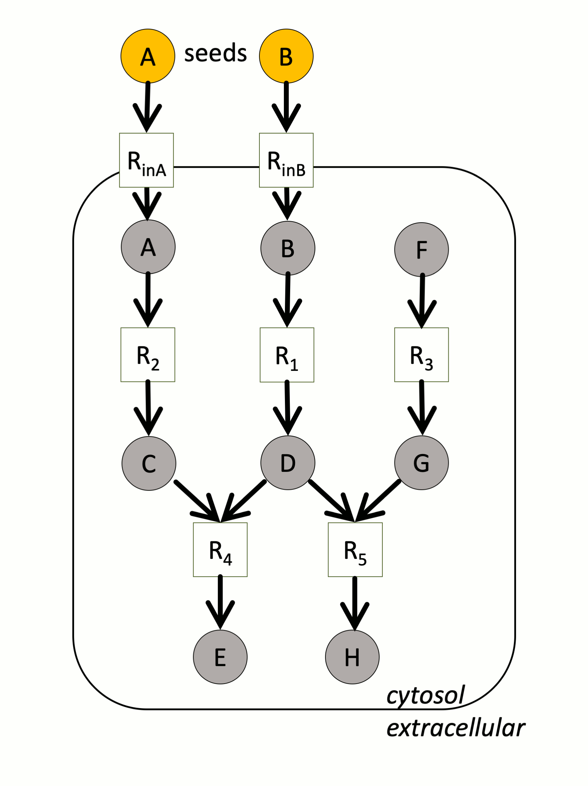

==========================
Supplementary information
==========================

Scope criterion of graph-based producibility
============================================

The criterion used to assess producibility in m2m is graph-based.
It relies on the definition of scope introduced by [Eb2004]_.

More precisely, it uses seeds in addition to the metabolic model itself, that is to say the information on which compounds are available to initiate producibility. 
The seeds often consists in metabolites found in the growth medium.

Starting from the seeds, the sub-network that is reachable, also called *scope* is expanded until it reaches a fixed point. 
A metabolite is considered producible or reachable from the seeds if it belongs to the scope.
Similarly, a reaction is considered activable if all of its reactants are in the scope, that is to say are reachable. 
It is important to notice the conjunction in this rule : *all* the reactants need to be in the scope.

Therefore, the scope is computed following these two conditions:

* initiation condition: a metabolite is in the scope if it belongs to the seeds.
* recursive condition: a metabolite is in the scope if it is the product of a reaction whose reactants are in the scopes (all of them).

The computation of the scope in m2m is performed with logic programming: `Answer Set Programming <https://potassco.org/>`_.

In the example above, a small metabolic network consists of 5 reactions (squares) and 8 metabolites (circles).
`A` and `B` are the seeds.
The yellow compounds or reactions are respectively reachable or activable.
In particular, note that `H` cannot be produced because one of the reactants of `R5` is not producible. 

.. [Eb2004] O. Ebenhöh, T. Handorf, and R. Heinrich, “Structural analysis of expanding metabolic networks.,” Genome informatics. International Conference on Genome Informatics, vol. 15, no. 1, pp. 35–45, 2004.